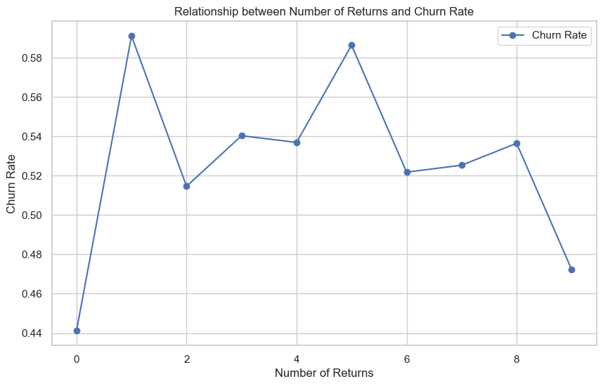

# SKN11-2nd-2Team
# 2nd-project

# 팀명 : yee 조

# 👨‍💻팀원 소개
<div align="center">

| 이선호 | 신준희 | 전유빈 | 이현민 |
|--------|--------|--------|-------|
|  |  |  |  |

</div>

# 📅 개발기간
2025.03.31 ~ 2025.4.01 (2일)

# 주제 : 전자상거래 이탈률 분석

##  주제 선정 이유 :

<figure  style="text-align: center;">

<figcaption>데이터 프레임 정보</figcaption>
</figure>

<figure  style="text-align: center;">

<figcaption>데이터 프레임 정보</figcaption>
</figure>

🔗 관련 기사:
- [온라인쇼핑 성장 속도, 대형마트 10배… 소매시장 연평균 3.2% ↑](https://www.industrynews.co.kr/news/articleView.html?idxno=55490)

- [온라인 쇼핑, 지난 10년간 대형마트 압도하며 소매시장 주도](https://www.electimes.com/news/articleView.html?idxno=343054)


## 📂 분석에 사용한 데이터셋

kaggle - Online Retail Customer Churn Dataset


**데이터 내용:** 
온라인 소매 매장과의 고객 상호작용에 대한 포괄적인 개요

## 기술 스택
### 데이터 시각화

 |||
# 📅 WBS: 고객 이탈 예측 프로젝트 (2025.03.31 ~ 2025.04.01)

| 담당자   | 작업 내용                                                                                     | 기간       |
|----------|-----------------------------------------------------------------------------------------------|------------|
| 이선호   | - EDA 시나리오 2 분석<br>- RandomForest, CatBoost, LightGBM 모델 학습<br>- 원본 데이터 전처리         | 3.31 ~ 4.1 |
| 신준희   | - EDA 시나리오 3, 4, 5 분석<br>- XGBoost 모델 학습<br>- Fake 데이터 생성 및 전처리           | 3.31 ~ 4.1 |
| 전유빈   | - EDA 시나리오 6 분석<br>- LightGBM 모델 학습<br>- 원본 데이터 전처리<br>- README 작성<br>- EDA 전체 정리 | 3.31 ~ 4.1 |
| 이현민   | - EDA 시나리오 1 분석<br>- 로지스틱 회귀, SVM 모델 학습                                     | 3.31 ~ 4.1 |


## 🔍 DataSet을 통해 얻고자 하는 인사이트

**이탈 위험이 있는 고객을 식별하여 타겟팅된 고객 유지 전략 수립**

# 데이터 전처리 과정
1. 사용하지 않는 feature 제거 (Customer_ID)
2. 결측치 및 이상치 처리
3. 수치형 스케일링
4. 범주형 원-핫 인코딩
5. bool 형 int 형으로 변환 (Target_churn)

## 📌 전처리 요약표

| 전처리 항목         | 내용                                                   | 목적                          |
|----------------------|--------------------------------------------------------|-------------------------------|
| 식별자 제거          | `Customer_ID` 컬럼 제거                                 | 모델 학습에 불필요한 정보 제거 |
| 성별 필터링          | `Gender == 'Other'`인 행 제거                           | 모호하거나 비율 낮은 범주 제거 |
| 범주형 인코딩        | `Gender`, `Email_Opt_In`, `Promotion_Response` → 원핫 인코딩 | 모델 입력에 적합한 형식 변환   |
| 수치형 정규화        | `StandardScaler` 적용 (int/float형 수치 변수 대상)      | 특성 간 스케일 차이 보정       |


# 데이터셋 데이터 구조
| Age | Gender | Annual_Income | Total_Spend | Years_as_Customer | Num_of_Purchases | Average_Transaction_Amount | Num_of_Returns | Num_of_Support_Contacts | Satisfaction_Score | Last_Purchase_Days_Ago | Email_Opt_In | Promotion_Response | Target_Churn |
|-----|--------|---------------|-------------|-------------------|------------------|----------------------------|-----------------|--------------------------|--------------------|------------------------|--------------|---------------------|--------------|
| 62  | Other  | 45.15         | 5892.58     | 5                 | 22               | 453.80                     | 2               | 0                        | 3                  | 129                    | True         | Responded           | True         |
| 65  | Male   | 79.51         | 9025.47     | 13                | 77               | 22.90                      | 2               | 2                        | 3                  | 227                    | False        | Responded           | False        |
| 18  | Male   | 29.19         | 618.83      | 13                | 71               | 50.53                      | 5               | 2                        | 2                  | 283                    | False        | Responded           | True         |
| 21  | Other  | 79.63         | 9110.30     | 3                 | 33               | 411.83                     | 5               | 3                        | 5                  | 226                    | True         | Ignored             | True         |
| 21  | Other  | 77.66         | 5390.88     | 15                | 43               | 101.19                     |


# EDA 절차

##  **데이터 로드** 
```
df = pd.read_csv('./data/online_retail_customer.csv')
```

## 이상치 처리

#### 실제 데이터


- 데이터에 이상치 없음을 확인
#


## 데이터 시각화
- ### **시나리오 1: 고객 만족도와 이탈률의 관계 분석**

> 🤔 "만족도가 낮은 고객은 실제로 더 많이 이탈하는가?"

- 변수: `Satisfaction_Score`, `Num_of_Support_Contacts`
- 예상 인사이트:
    - 만족도 3 이하인 고객은 이탈률이 급증한다
    - 지원팀에 자주 연락한 고객이 이탈 가능성이 높다
- 활용: **고위험 고객 조기 알림**, 만족도 회복 캠페인 설계


- 실제 인사이트:
    - 만족도 점수가 중간 수준인 3점에서 이탈률이 급격히 증가하며, **최고치인 약 58%**를 기록함

    - 이는 중간 만족도를 가진 고객이 기대치가 충족되지 않아 쉽게 다른 브랜드로 전환할 가능성이 있음을 나타냄

    - 그문의 횟수가 3회로 증가하면 이탈률이 급격히 상승(약 0.54)

    - 이는 고객이 여러 번 지원 요청을 해야 하는 상황에서 불만족하거나 문제 해결이 지연된다고 느낄 가능성을 암시함

### **시나리오 2: 소비/구매 패턴 기반 이탈 위험 분석**

> 🛒 "적게 사고 적게 쓰는 고객이 이탈하는가?"
> 
- 변수: `Total_Spend`, `Num_of_Purchases`, `Average_Transaction_Amount`
- 예상 인사이트:
    - 평균 소비가 낮고 거래 빈도가 낮은 고객은 이탈 가능성이 높다
    - 반대로 VIP 고객은 더 오래 유지된다
- 활용: **VIP 보호, 저활동 고객 타겟 프로모션**


- 실제 인사이트:
    - 총 지출
        - 총 지출이 낮은 고객 그룹의 이탈률이 상대적으로 낮고 총 지출이 높은 그룹의 이탈률이 높아지는 경향이 보임

        - 지출이 높은 고객은 기대치가 높고, 만족하지 못할 경우 이탈 가능성이 커질 수 있음을 암시

    - 구매 횟수
        - 구매 횟수가 적은 고객의 이탈률이 높다

        - 구매 빈도가 높을수록 브랜드 충성도가 강해지고, 이탈 가능성이 낮아지는 경향을 보임

    - 평균 거래 금액
        - 평균 거래 금액이 중간 수준인 고객의 이탈률이 가장 높다
        평균 거래 금액이 낮거나 매우 높은 경우에는 이탈률이 다소 낮아짐

        - 중간 수준의 거래 금액을 가진 고객은 가격 민감도가 높거나, 더 나은 대안을 찾으려는 경향이 있을 수 있음


### **시나리오 3: 마지막 구매 이후 시간과 이탈의 관계**

> 📆 "오래 구매하지 않으면 정말 이탈하는가?"
> 
- 변수: `Last_Purchase_Days_Ago`
- 예상 인사이트:
    - 평균(183일) 이상 구매 이력이 없는 고객은 이탈률 급증
- 활용: **재구매 유도 캠페인 시점 설정**, 예측 모델의 핵심 피처


- 실제 인사이트:
    - 평균(183일) 이상 구매 이력이 없는 고객의 이탈률이 구매 이력이 있는 고객의 이탈률보다 약간 더 높다 
    - 이는 구매 공백 기간이 길어질수록 고객 충성도가 약화될 가능성을 시사 

### **시나리오 4: 프로모션 반응과 이탈 관계**

> 📢 "프로모션에 응답한 고객은 더 잘 유지되는가?"
> 
- 변수: `Promotion_Response`
- 예상 인사이트:
    - 'Unsubscribed' 고객은 이탈률이 매우 높음
    - 'Responded' 고객은 충성도 높음
- 활용: **프로모션 반응 기반 타겟팅 및 예측 피처**


- 실제 인사이트:
    - 프로모션에 대해 무응답(Ignored), 응답(Responded), 또는 구독 취소(Unsubscribed) 한 고객 간 이탈률 차이가 크지 않음

    - 프로모션 자체가 고객 유지에 큰 영향을 주지 못하고 있음

### **시나리오 5: 이메일 수신 동의 고객과 이탈률 비교**

> 💌 "이메일 수신 동의한 고객은 이탈 가능성이 낮은가?"
> 
- 변수: `Email_Opt_In`
- 예상 인사이트:
    - 동의한 고객이 더 많이 유지되는 경향
- 활용: **이메일 마케팅 전략 정당화**


- 실제 인사이트:
    - 이메일 수신 동의 여부에 따른 이탈률은 거의 동일함
    - 이메일 마케팅 만으로는 고객 이탈을 방지하기 어려울 수 있음을 시사


### 시나리오 6

- 반품 횟수와 이탈율 관계
    - 예상 인사이트 : 반품 횟수가 많으면 이탈하는 경향




- 실제 인사이트: 
    - 반품을 하지 않은 고객의 이탈률은 약 0.44 로 가장 낮음
    - 반품 횟수가 1회로 증가하면 이탈률 급격히 상승(0.58)
    - 반품 횟수가 8회 이상인 경우 이탈률 다시 감소 (0.46)

- 연령대와 이탈율 관계
    - 예상 인사이트 : 나이가 많으면 서비스 이탈률 높음


- 실제 인사이트: 
    - 0~20세 연령대의 이탈률이 가장 높으며(60% 이상), 이는 젊은 고객층의 충성도가 낮거나 브랜드 전환 가능성이 높음을 나타냄

    - 31~40세 연령대는 가장 낮은 이탈률을 보이며, 안정적인 고객층으로 판단

    - 41세 이상부터는 이탈률이 다시 증가하며, 특히 61~70세 연령대에서 높은 수준을 유지함

- 성별과 이탈율 관계
    - 현재 성별 범주 3가지 (남, 여, others)
    - 3가지로 구분할지 others를 남 녀로 섞을지 
    


- 실제 인사이트:
    - 여성(Female)과 남성(Male)의 평균 이탈률 차이는 거의 없음

    - 이는 성별이 고객 이탈에 큰 영향을 미치지 않음

# 📊 고객 이탈 예측 모델 성능 비교

## 실험 개요

- 목적: 다양한 모델의 성능을 비교하여 최적의 이탈 예측 모델 선정
- 구성:
  - **전처리 + Optuna 기반 기본 모델**
  - **전처리 + Optuna + SMOTE 오버샘플링 적용 모델**

---

## 실험 1: 전처리 + Optuna (기본 모델)

| 모델         | Train Acc | Test Acc | Precision | Recall | F1-score |
|--------------|-----------|----------|-----------|--------|----------|
| LogisticRegression | 0.54 | 0.52     | 0.48      | 0.80   | 0.60     |
| SVM (SVC)     | 0.73      | 0.46     | 0.49      | 0.59   | 0.54     |
| RandomForest  | 0.66      | 0.55     | 0.50      | 0.72   | 0.59     |
| XGBoost       | 0.68      | 0.53     | 0.49      | 0.84   | 0.61     |
| CatBoost      | 0.68      | 0.52     | 0.48      | 0.56   | 0.50     |
| **LightGBM**  | **0.71**  | **0.61** | **0.64**  | **0.62** | **0.61** |

---

## 실험 2: 전처리 + Optuna + SMOTE 적용

| 모델         | Train Acc | Test Acc | Precision | Recall | F1-score |
|--------------|-----------|----------|-----------|--------|----------|
| LogisticRegression | 0.53 | 0.57     | 0.53      | 0.82   | 0.64     |
| SVM (SVC)     | 0.54      | 0.56     | 0.53      | 0.72   | 0.61     |
| RandomForest  | 0.71      | 0.51     | 0.49      | 0.58   | 0.53     |
| XGBoost       | 0.63      | 0.52     | 0.50      | **0.95** | 0.65     |
| CatBoost      | **0.98**  | 0.49     | 0.47      | 0.90   | 0.60     |
| LightGBM      | 0.64      | **0.61** | 0.65      | 0.62   | 0.63     |

>  CatBoost는 train 0.98 vs test 0.49로 **과적합** 심각  
>  XGBoost는 **이탈 탐지율(Recall)**이 매우 높지만 precision이 낮아 **오탐 가능성** 존재  
>  LightGBM은 test accuracy와 균형 잡힌 성능으로 여전히 **안정적 성능 유지**

---

# 고객 이탈 예측 리포트

---

## 최종 선정 모델: LightGBM (전처리 + Optuna 튜닝)

### 최종 성능 요약


## 📉 ROC Curve 결과


| 항목         | 값   | 설명 |
|--------------|------|------|
| **AUC Score** | **0.44** | ⚠️ 랜덤보다 낮음 (0.5 미만) → 심각한 예측 왜곡 가능성 |

> ❗ AUC가 0.44라는 것은 **모델의 확률 예측이 클래스 구분에 실패했거나 반대로 학습했을 가능성**이 있다는 것을 의미함.

---

## 🔍 문제 분석 및 한계점

### ✅ 강점
- **이탈 고객 탐지력 우수** (Recall = 0.75)
- **정확도 61.76%는 baseline 대비 개선**
- **불균형 데이터에 대해 리콜 중심 대응 가능**

### ❗ 약점
- **ROC AUC가 0.5 미만** → 확률 기반 분류 신뢰도 낮음
- **유지 고객(0번)에 대한 recall 낮음 (0.51)** → 과잉 분류 가능성
- **predict_proba로 확률 기반 시스템 설계 어려움**

### 보완점
- Feature selection
    - 피쳐 중요도에 따라 selection -> 학습 결과 개선 x
- Feature Engineering
    - 여러 파생 변수 추가 후 학습 -> 학습 결과 개선 x 
- 데이터 증강(Smote, Faker 등)

---

# 🔖faker 데이터 증강 후

#### 이상치 처리 전


#### 이상치 처리 후


- 이상치 제거


(Faker 데이터 증강 이후)
| 모델 | train_acc | test_acc | precision | recall | f1-score |
| --- | --- | --- | --- | --- | --- |
| 로지스틱회귀 | 0.69 | 0.68 | 0.66 | 0.68 | 0.67 |
| SVM(SVC) | 0.76 | 0.73 | 0.75 | 0.66 | 0.70 |
| RandomForest | 0.80 | 0.79 | 0.80 | 0.74 | 0.77 |
| **XGBoost** | **0.80** | **0.79** | **0.80** | **0.75** | **0.77** |
| CatBoost | 0.80 | 0.79 | 0.80 | 0.74 | 0.77 |
| LightGBM | 0.80 | 0.79 | 0.80 | 0.75 | 0.77 |

---
## 📉 ROC Curve 결과


| 항목                             | 값   | 설명 |
|----------------------------------|------|------|
| **AUC Score (Logistic Regression)** | **0.73** | AUC는 0.5 이상이면 우연보다 나은 성능이며, 0.7 이상이면 우수한 성능으로 간주됨 |
| **AUC Score (XGBoost)**            | **0.78** | 두 모델 중 XGBoost가 더 높은 분류 성능을 보임 |

**결론적으로**, 두 모델 모두 일정 수준 이상의 분류 성능을 보였으며,  
그 중에서도 **XGBoost가 Logistic Regression보다 더 우수한 성능을 나타냈습니다.**

## 🔍 중요 피처 인사이트 (Feature Importance 기반)


| 중요 변수                  | 인사이트 요약 |
|---------------------------|----------------|
| `Annual_Income`         | 소득 수준이 높을수록 이탈 경향이 뚜렷함 (단발 소비 가능성) |
| `Num_of_Purchases`      | 반복 구매가 많을수록 이탈률 낮음 → 충성고객 지표 |
| `Average_Transaction_Amount` | 건당 금액이 클수록 단발 소비 경향. 리텐션 필요 |
| `Age`, `Total_Spend`      | 연령과 총 지출도 유의미. 하지만 반복성과의 상관이 중요 |
| `Last_Purchase_Days_Ago`  | 마지막 구매 시점이 오래되었을수록 이탈 위험 ↑ |
| `Num_of_Support_Contacts` | 고객 불만 지표로 활용 가능. 빈번한 문의는 이탈 위험요인 |
| `Satisfaction_Score`      | 단독 영향은 낮지만 지출, 구매와의 파생 조합에 영향 가능 |

---

## 📌 실전 비즈니스 인사이트

### 💸 고소득, 고액 소비자 = 우선 관리 타겟
- 단발성 구매 경향이 높고 이탈 확률도 큼  
→ **혜택 제공 / 개인화 마케팅 필요**

### 🔁 반복 구매자 = 충성 고객
- **리텐션 리워드 설계**로 유지 전략 필요

### ⏰ 마지막 구매일이 오래됨 = 이탈 징조
- **90일 이상 미구매자 타겟 프로모션 자동화**

### 📞 CS 이용 많은 고객 = 불만족 → 이탈
- **상담 이력 기반 사전 이탈 예측 시스템 구성**

---

---

# 한줄 회고
- 유빈 : 성능이 잘 나오지는 못했지만 수업 때 배운 내용을 모두 사용해 볼 수 있어서 좋은 경험이었다고 생각합니다
- 선호 : 성능이 잘 나오지 않았지만 경험을 많이 할 수 있어 좋았고 데이터의 중요성을 알게되었습니다.
- 준희 : 프로젝트를 진행하면서 성능이 잘 나오지 않아 데이터셋이 얼마나 중요한지 깨달았습니다. 이러한 과정에서 배운 내용들을 많이 사용할 수 있어서 좋았습니다.
- 현민 : 프로잭트를 진행하면서 많은 부족함을 느꼈고 짧은 기간이였지만 많은 도움을 준 팀원들에게 감사함을 전하고 싶습니다.
